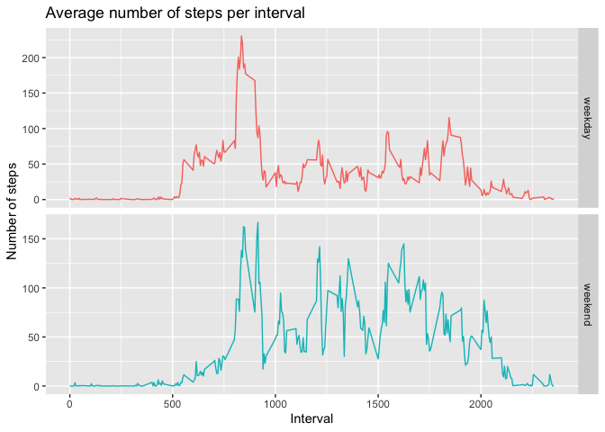

## What is mean total number of steps taken per day?

Loading data, processing data and creating a histogram:

```r
##Importing the data
rawdf <- read.csv("activity.csv")
##Removing NAs
dfnona <- rawdf[complete.cases(rawdf),]
##Aggregating the data
dfhist <- aggregate(steps~date, data=dfnona, sum)
##Plotting the histogram
hist(dfhist$steps, xlab = "Steps", main = "Total number of steps taken per day", col = "#1A089C")
```

<!-- -->

Mean number of steps per day:

```r
m1<-mean(dfhist$steps)
m1
```

```
## [1] 10766.19
```

Median number of steps per day:

```r
m2<-median(dfhist$steps)
m2
```

```
## [1] 10765
```


## What is the average daily activity pattern?

Processing data:

```r
library("ggplot2")
dfts<-aggregate(steps~interval, data=dfnona, mean)
plot(dfts$interval, dfts$steps, type="l", main="Average daily steps per time interval",
     xlab="5-min interval", ylab="Average number of steps", col= "#1A089C")
```

<!-- -->

Interval with maximum average number of steps:

```r
dfts[dfts$steps == max(dfts$steps),][1,1]
```

```
## [1] 835
```


## Imputing missing values

Number of missing values in the dataset:

```r
nrow(rawdf[is.na(rawdf),])
```

```
## [1] 2304
```

Replacing missing values by the average number of steps within the 5-min interval in a new dataset:

```r
newdf<-rawdf
for (i in 1:nrow(newdf)) {
    if (is.na(newdf[i,]["steps"])==TRUE) {
        newdf[i,1]<-dfts[dfts$interval==newdf[i,"interval"],][,"steps"]
    }
}
```

Histogram with new dataset:

```r
dfhist2 <- aggregate(steps~date, data=newdf, sum)
hist(dfhist2$steps, xlab = "Steps", main = "Total number of steps taken per day", col = "#BC1589")
```

<!-- -->

Mean number of steps per day:

```r
m1<-mean(dfhist2$steps)
m1
```

```
## [1] 10766.19
```
The mean of the number of steps taken per day did not change after the missing values were replaced.

Since data is missing over full days at a time, adding average values by interval did not change average of the day, and in turn did not change the total average.

Median number of steps per day:

```r
m2<-median(dfhist2$steps)
m2
```

```
## [1] 10766.19
```
The median of the number of steps taken per day increased slightly after the missing values were replaced and is now equal to the mean.


## Are there differences in activity patterns between weekdays and weekends?

Creating of weekday/weekend flag:

```r
newdf$date<-as.Date(newdf$date)
for (i in 1:nrow(newdf)){
    if (weekdays(newdf$date[i]) %in% c("Saturday", "Sunday")) {
        newdf$wdflag[i] <- "weekend"
    } else {newdf$wdflag[i] <- "weekday"}
}
```

Processing data:

```r
wedf<-newdf[newdf$wdflag=="weekend",]
wedfs<-aggregate(steps~interval+wdflag, data=wedf, mean)
wkdf<-newdf[newdf$wdflag=="weekday",]
wkdfs<-aggregate(steps~interval+wdflag, data=wkdf, mean)
gdata<-rbind(wedfs,wkdfs)
```

Creating comparison graph:

```r
ggplot(gdata, aes(x=interval, y=steps)) + geom_line(aes(color=wdflag)) +
    facet_grid(wdflag~., scales = "free_y") + theme(legend.position="none") +
    labs(title = "Average number of steps per interval") +
    xlab("Interval") + ylab("Number of steps")
```

<!-- -->

By looking at the graphs, we can observe that the pattern between weekdays and weekends are quite different.

